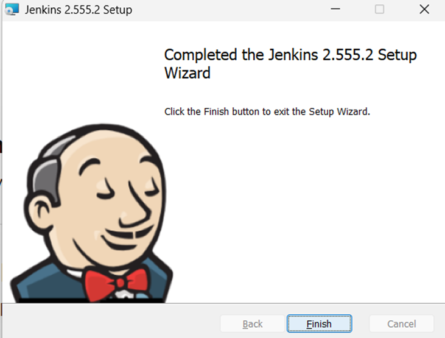
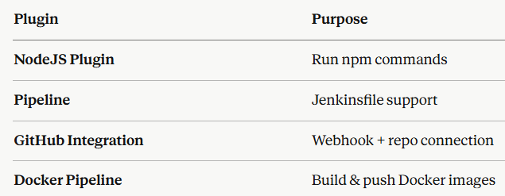
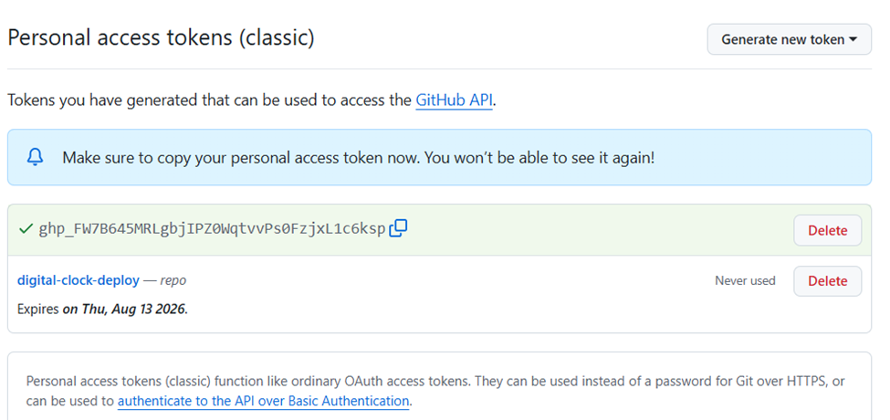
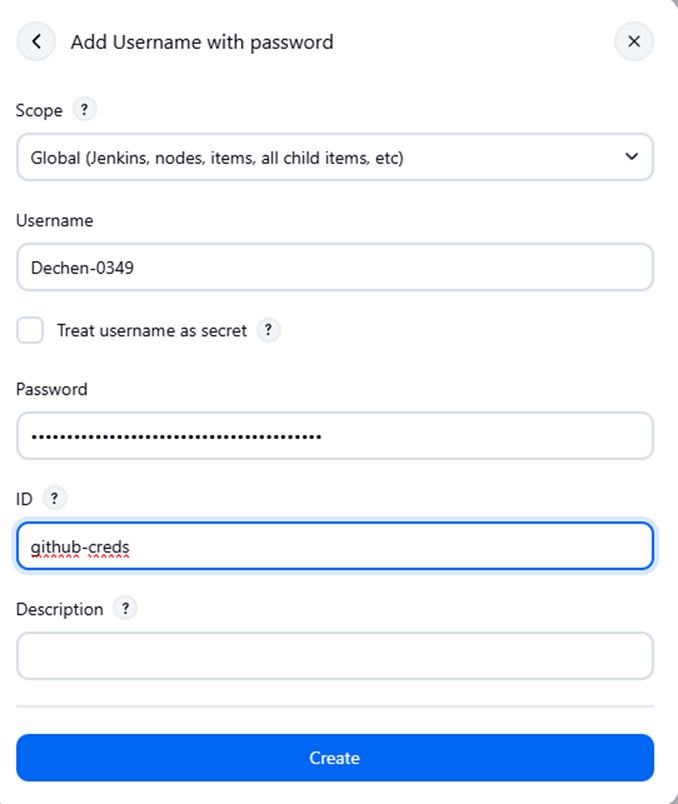
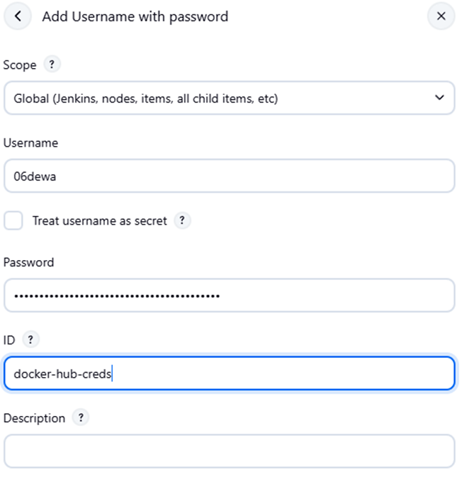
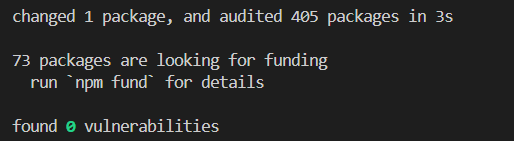
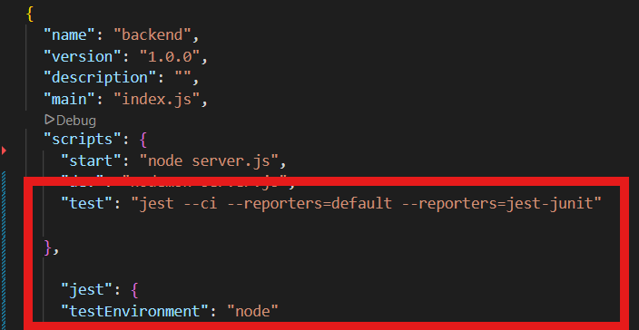
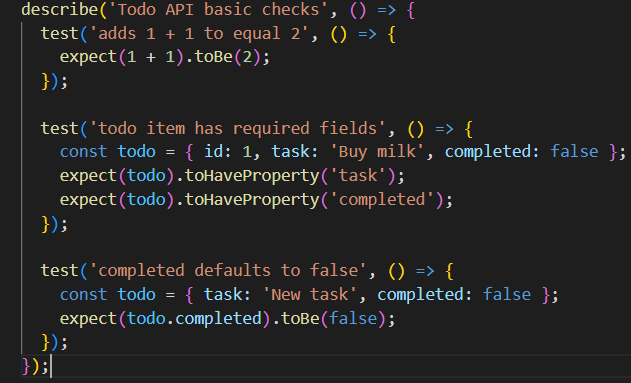
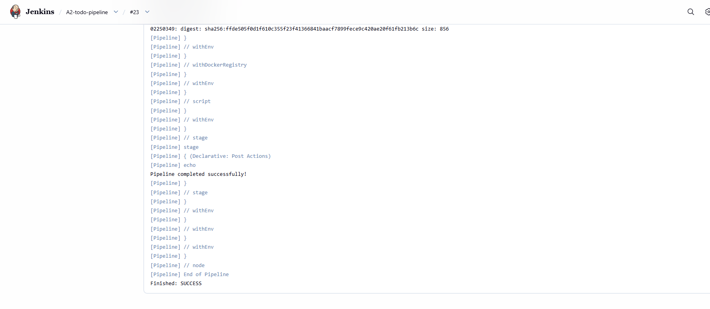

# DSO101 Assignment 1 — To-Do App with Docker

## AIM
The aim of this assignment is to configure and implement Jenkins CI/CD pipeline that automates t he build, test and deployment process of a full stack application developed in Assignment 1.

---

## Objectives

1. **Set up Jenkins** — Install and configure Jenkins on a local 
   Windows machine with the required plugins including NodeJS Plugin, 
   Docker Pipeline, and GitHub Integration.

2. **Connect GitHub Repository** — Link the Jenkins pipeline to the 
   GitHub repository using a Personal Access Token (PAT) to enable 
   automated code checkout on every build.

3. **Automate Dependency Installation** — Configure the pipeline to 
   automatically install all backend dependencies using npm install 
   during every build.

4. **Implement Unit Testing** — Write and run unit tests using Jest 
   with JUnit reporting so that test results are recorded and visible 
   in Jenkins after every build.

5. **Automate Docker Image Build** — Configure the pipeline to 
   automatically build Docker images for both the frontend and 
   backend services using their respective Dockerfiles.

6. **Push Images to Docker Hub** — Automate the pushing of built 
   Docker images to Docker Hub registry using stored credentials 
   in Jenkins, making the images available for deployment.

7. **Document the Process** — Record all steps, configurations, 
   challenges faced, and outcomes in the README.md file with 
   supporting screenshots as evidence of successful pipeline execution.

---

## Theoretical Background

### Continuous Integration (CI)
Continuous Integration is a software development practice where developers frequently merge their code changes into a shared 
repository, usually several times a day. Each merge triggers an automated build and test process, allowing teams to detect and fix 
integration errors quickly. CI ensures that the codebase is always in a working state and reduces the risk of integration problems 
that can occur when developers work in isolation for long periods.

### Continuous Deployment (CD)
Continuous Deployment is an extension of Continuous Integration where every code change that passes the automated tests is 
automatically deployed to the production or staging environment without manual intervention. This practice ensures faster delivery 
of new features, bug fixes, and updates to end users while maintaining software quality through automated testing at every 
stage of the pipeline.

### Jenkins
Jenkins is an open-source automation server widely used for implementing CI/CD pipelines. It allows developers to automate 
the building, testing, and deployment of applications. Jenkins supports hundreds of plugins that integrate with various tools 
such as GitHub, Docker, and Node.js. A Jenkins pipeline is defined using a Jenkinsfile written in Groovy scripting language, 
which describes all the stages of the build process in a structured and readable way.

### Pipeline as Code
Pipeline as Code is the practice of defining the entire CI/CD pipeline configuration in a file (Jenkinsfile) that is stored 
alongside the application source code in the version control system. This approach makes the pipeline configuration 
transparent, version-controlled, and reproducible. Any changes to the pipeline can be tracked, reviewed, and rolled back just 
like application code changes.

### Docker and Containerization
Docker is an open-source platform that allows developers to package applications and their dependencies into lightweight, 
portable containers. Containers ensure that the application runs consistently across different environments, eliminating the 
common "it works on my machine" problem. In a CI/CD pipeline, Docker is used to build container images of the application 
and push them to a registry such as Docker Hub, from where they can be pulled and deployed to any environment.

### Docker Hub
Docker Hub is a cloud-based container registry service provided by Docker. It allows developers to store, share, and manage 
Docker images. In a CI/CD pipeline, Docker Hub acts as the central repository where built images are pushed after a 
successful build and can later be pulled for deployment on any server or cloud platform.

### Unit Testing with Jest
Jest is a popular JavaScript testing framework developed by Meta (Facebook). It is widely used for testing Node.js backend 
applications and React frontend applications. Jest provides a simple and clean syntax for writing unit tests, and supports 
features such as test coverage reporting and JUnit XML output which integrates directly with Jenkins to display test results 
in a readable format after every pipeline run.

### Version Control with GitHub
GitHub is a web-based platform for version control using Git. It allows developers to host their source code repositories, 
collaborate with others, and track changes over time. In a CI/CD pipeline, GitHub serves as the source of truth for the 
application code. Jenkins connects to GitHub using a Personal Access Token and automatically triggers a new pipeline build 
whenever code changes are pushed to the repository.

---

## IMPLEMENTATION STEPS

### PART 1: Jenkins CI/CD Pipeline

### Step 1: Jenkins Setup

**i. Install Jenkins on Windows**

---

**ii. Install Required Plugins**

---

### Step 2:: GitHub Repository Setup

**1. Project Structure**

---

**2. Generate a GitHub Personal Access Token (PAT)**
Generate new token by:

This token is very important for GitHub and Docker credentials

---

**3. Add GitHub Credentials in Jenkins**
 

---

**4. Add Docker Credentials in Jenkins**

---

### Step 3: Add Tests to the Backend
Before writing the Jenkinsfile, Jest tests is needed in the backend.

**Install Jest in the Backend:**

---

**Update backend/package.json scripts:**

---

**Create a simple test file backend/tests/app.test.js:**

Successfully tested

Successfully generated:

---

### Step 4: Create Jenkinsfile
Create a file named Jenkinsfile in your repo root (not inside frontend or backend)

---

### Step 5: Create Jenkins Pipeline Job

**In Pipeline section:**

1. Definition: Pipeline script from SCM
2. SCM: Git
3. Repository URL: https://github.com/yourusername/your-repo.git
4. Credentials: select github-creds
5. Branch: */main
6. Script Path: Jenkinsfile
7. Click Save

---

### Step 6: Run the Pipeline

---

## Conclusion

This assignment provided hands-on experience in setting up a complete 
CI/CD pipeline using Jenkins for a full-stack to-do list application. 

Through this process, I successfully configured Jenkins to automatically 
checkout code from GitHub, install dependencies, run unit tests using 
Jest, build Docker images for both the frontend and backend, and push 
them to Docker Hub registry.

Several challenges were encountered and resolved during the process, 
such as configuring Jenkins on Windows where I often got the credentials wrong resultingg in many attempt errors

Overall, this assignment demonstrated the importance of CI/CD automation 
in modern software development. By automating the build, test, and 
deployment process, the pipeline ensures that every code change is 
consistently tested and deployed, reducing manual effort and the risk 
of human error. This experience has strengthened my understanding of 
DevOps practices and tools used in real-world software engineering 
environments.