# DSO101 Practical Report

**Module:** DSO101 - Continuous Integration and Continuous Deployment  
**Report Type:** Practical README Report  
**Student Name:** Dechen Wangmo  
**Student ID:** 0225034

---

## Table of Contents

1. [Practical 1: Basic Linux](#practical-1-basic-linux)
2. [Practical 2: Basic Docker Commands](#practical-2-basic-docker-commands)
3. [Practical 3: Docker Tasks](#practical-3-docker-tasks)
4. [Practical 4: Jenkins](#practical-4-jenkins)
5. [Practical 5: Data Persistence](#practical-5-data-persistence)
6. [Practical 7: Dockerfile](#practical-7-dockerfile)
---

# Practical 1: Basic Linux Commands

### Objective 

The main objective in this practical is to learn the basic Linus Commands for navigation, directory management, viewing files, etc.

### Actions Performed

### Task 1: Navigation

Basic navigation commands were practiced to understand how to move around the Linux file system.

```bash
pwd  
ls
ls -a
cd ~
cd ..
```
---

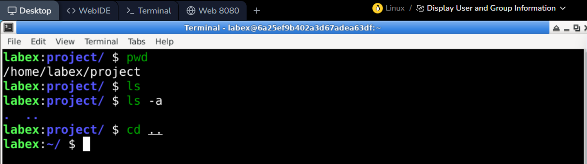

---

| Command | Explanation |
|---------|-------------|
| `pwd` | Prints your current directory location |
| `ls` | Lists all files and folders in current directory |
| `ls -a` | Lists all files including hidden ones |
| `cd ~` | Takes you to your home directory |
| `cd ..` | Goes one folder back/up |

---

### Task 2: Directory Management

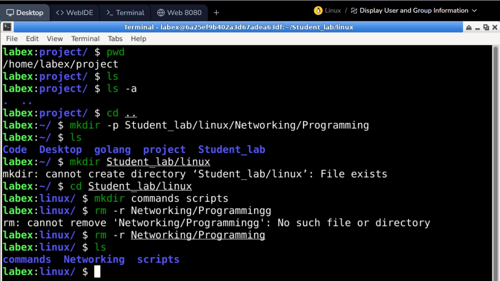

---

| Command | Explanation |
|---------|-------------|
| `mkdir -p Student_lab/linux/Networking/programming` | Creates all folders in the path at once |
| `cd Student_lab/linux` | Moves into the Student_lab/linux folder |
| `mkdir Commands Scripts` | Creates two folders named Commands and Scripts |
| `rm -r Networking/programming` | Deletes the programming folder and everything inside it |

---

### Task 3: File Management

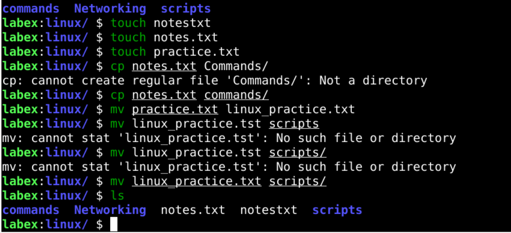

| Command | Explanation |
|---------|-------------|
| `touch notes.txt` | Creates a new empty file called notes.txt |
| `touch practice.txt` | Creates a new empty file called practice.txt |
| `cp notes.txt Commands/` | Copies notes.txt into the Commands folder |
| `mv practice.txt linux_practice.txt` | Renames practice.txt to linux_practice.txt |
| `mv linux_practice.txt Scripts/` | Moves linux_practice.txt into the Scripts folder |

---

### Task 4: File Viewing

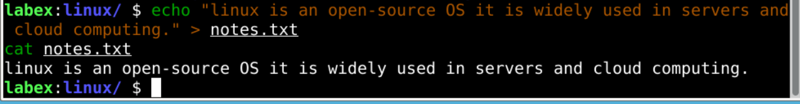

---

| Command | Explanation |
|---------|-------------|
| `echo "linux is an open-source OS it is widely used in servers and cloud computing." > notes.txt` | Writes the sentence into notes.txt, overwriting existing content |
| `cat notes.txt` | Displays the full content of notes.txt in the terminal |

---

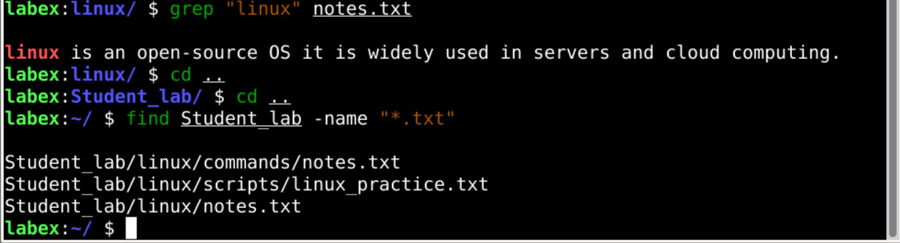

---

### Task 5: Searching

| Command | Explanation |
|---------|-------------|
| `grep "linux" notes.txt` | Searches for the word linux inside notes.txt and shows matching lines |
| `find Student_lab -name "*.txt"` | Finds all .txt files inside the Student_lab folder |

---

### Task 6: Network Commands

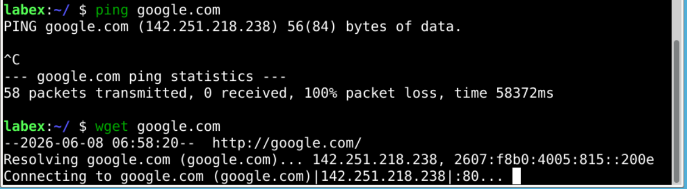

---

| Command | Explanation |
|---------|-------------|
|`wget -y` | Installs wget automatically without manual confirmation |
| `ping google.com` | Tests internet connection by sending packets to google.com, press `Ctrl+C` to stop |
| `wget https://example.com` | Downloads the webpage at example.com and saves it locally |

---

### Task 7: System Information

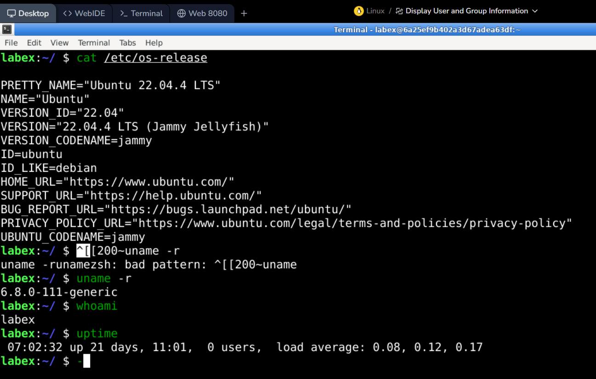

---

| Command | Explanation |
|---------|-------------|
| `cat /etc/os-release` | Displays the Linux operating system version and details |
| `uname -r` | Shows the current Linux kernel version |
| `whoami` | Displays the currently logged-in username |
| `uptime` | Shows how long the system has been running |


---

### Task 8: Bonus Task

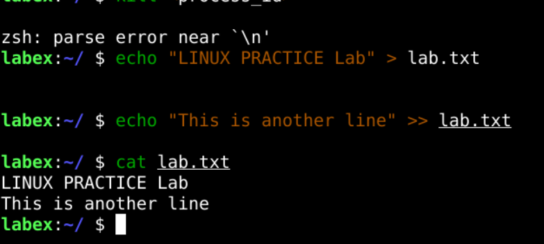


| Command | Explanation |
|---------|-------------|
| `echo "LINUX PRACTICE Lab" > lab.txt` | Creates lab.txt and writes the text into it, overwriting any existing content |
| `echo "This is another line" >> lab.txt` | Appends a second line to lab.txt without deleting existing content |
| `cat lab.txt` | Displays the full content of lab.txt to confirm both lines are saved |

---

## Learning 
From this practical, I learned how to use essential Linux commands for managing files, folders, processes, and system information. These commands are important for working with servers, Docker, Jenkins, and cloud deployment environments.

---

# Practical 2: Basic Docker Commands

### Objective

The objective of this practical was to learn the basic Docker commands used to run containers, list containers, stop and remove containers, manage images, inspect container files, and run containers in detached mode.

### Tasks Performed

#### Task 1: Start a Container

A CentOS 7 container was started using the `docker run` command.

```bash
docker run centos:7
```
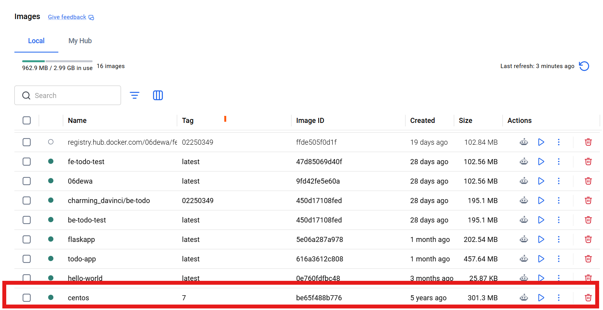

---

#### Task 2: List Running and All Containers

Docker containers were listed using `docker ps` and `docker ps -a`.

```bash
docker ps
docker ps -a
```
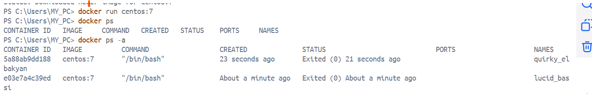

---
#### Task 3: Stop a Container

A running container was stopped using the container ID or container name.

```bash
docker stop <container_id>
```
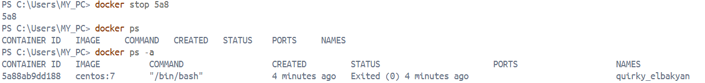

---

#### Task 4: Remove a Container

A stopped container was removed using the `docker rm` command.

```bash
docker rm <container_id>
```
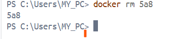

---
#### Task 5: Show Docker Images

Available Docker images on the local system were displayed.

```bash
docker images
```
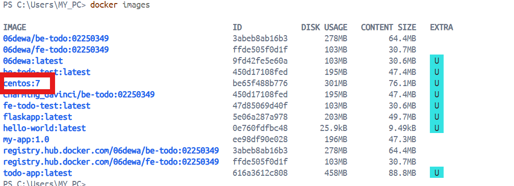

---
#### Task 6: Remove Docker Image

A Docker image was removed after stopping and deleting the container using it.

```bash
docker rmi <image_name>
```

---

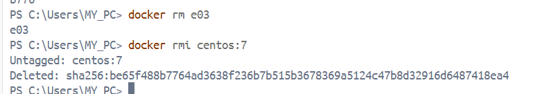

---
#### Task 7: Pull Docker Images

An image was downloaded from Docker Hub using the `docker pull` command.

```bash
docker pull <image_name>
```
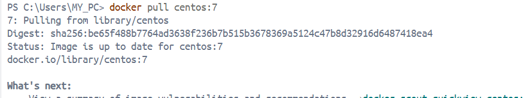

---
#### Task 8: Inspect Container File Contents

The `/etc/hosts` file inside a container was viewed without opening an interactive shell.

```bash
docker exec <container_id> cat /etc/hosts
```


---
#### Task 9: Show Docker Version

The installed Docker version was checked.

```bash
docker --version
```

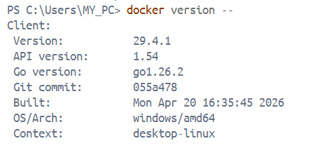

---

#### Task 10: Rename a Container

A container was renamed using the `docker rename` command.

```bash
docker rename <old_name> <new_name>
```
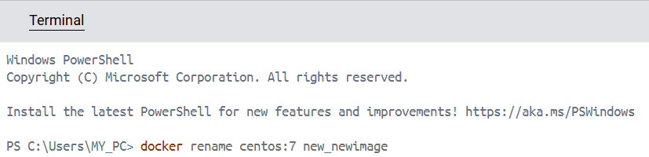

---
#### Task 11: Run a Container in Detached Mode

A container was started in detached mode so that it could run in the background.

```bash
docker run -d centos:7
```
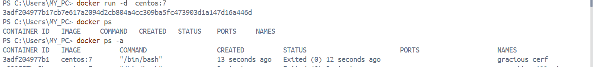

---
#### Task 12: Run a Container for a Specific Time

A container was run for 20 seconds using the `sleep` command.

```bash
docker run -d centos:7 sleep 20
```
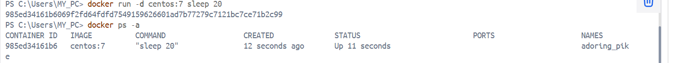

---

### Learning Outcome

From this practical, I learned how Docker containers and images are managed using common Docker CLI commands. I also understood that images must be pulled or built first, containers are created from images, and containers should be stopped and removed before removing related images.

---

# Practical 3: Docker Tasks

### Objective

The objective of this practical was to practice specific Docker container tasks, including running a container with a custom exit code and creating a simple timer inside a container.

### Tasks Performed

#### Task 1: Stop a Docker Container with Exit Code 130

A CentOS 7 container was run with a command that exits using exit code `130`.

```bash
docker run centos:7 /bin/bash -c "exit 130"
```

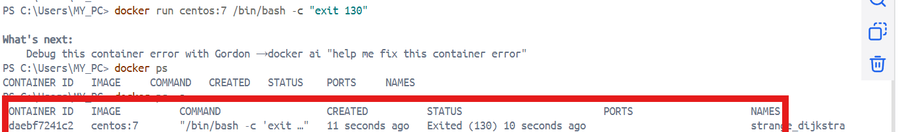

---

The exit code can be checked using:

```bash
docker ps -a
```

#### Task 2: Create a Timer in Docker

An Alpine container was used to print the current date and time every second.

```bash
docker run alpine sh -c "while true; do date; sleep 1; done"
```
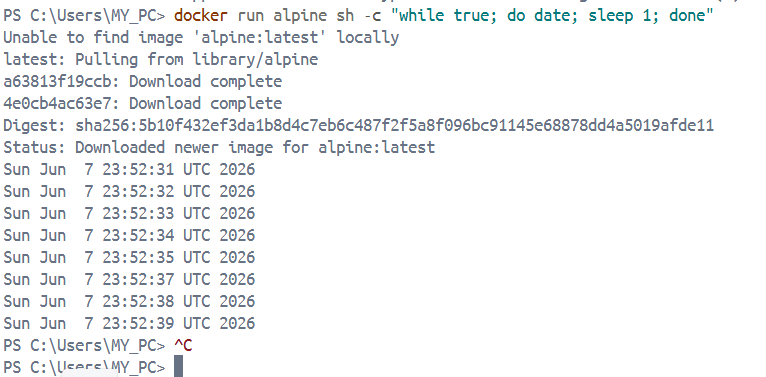

### Learning Outcome

From this practical, I learned that Docker containers can execute custom commands when they start. I also learned how exit codes help identify why a container stopped and how simple shell scripts can run inside containers.

---

## Practical 4: Jenkins

### Objective

The objective of this practical was to pull and run Jenkins using Docker, inspect the container details, map Jenkins to port `8080`, and open Jenkins in the browser for installation.

### Tasks Performed

#### Task 1: Pull Jenkins Image

The Jenkins image was pulled from Docker Hub.

```bash
docker pull jenkins/jenkins:latest
```

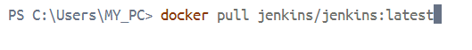


#### Task 2: Check If Jenkins Container Is Running

The running container was checked using:

```bash
docker ps
```

#### Task 3: Inspect Container Details

The Jenkins container was inspected to find information such as port, IP address, and gateway.

```bash
docker inspect <container_id>
```

Important details checked:

- Port: `8080`
- IP Address: `172.17.0.2:8080`
- Gateway: `172.17.0.1`

#### Task 4: Perform Port Mapping

Jenkins was started with port mapping from the container to the local machine.

```bash
docker run -p 8080:8080 jenkins/jenkins:latest
```

The initial Jenkins password was copied from the terminal output.

#### Task 5: Open Jenkins in Browser

Jenkins was opened using:

```text
http://localhost:8080
```

The copied password was entered to unlock Jenkins, and the installation process was completed.

### Learning Outcome

From this practical, I learned how to run Jenkins inside Docker and access it through the browser using port mapping. I also understood the importance of the Jenkins initial admin password during the first setup.

---

## Practical 5: Data Persistence

### Objective

The objective of this practical was to understand Docker data persistence by storing Jenkins data outside the container using Docker volumes.

### Tasks Performed

#### Task 1: Create a Local Directory

A directory was created to store Jenkins data.

```bash
mkdir my-jenkins-data
```

#### Task 2: Perform Port Mapping and Volume Mapping

Jenkins was started with both port mapping and volume mapping.

```bash
docker run -p 8080:8080 -v my-jenkins-data:/var/jenkins_home jenkins/jenkins:latest
```

The volume mapping stores Jenkins configuration, plugins, jobs, and other data outside the container.

#### Task 3: Install Python Libraries and Packages

After Jenkins was installed, Python-related libraries or packages were installed as part of the lab activity. This helped prepare the Jenkins environment for running automation or build tasks that may require Python.

Example command format:

```bash
pip install <package_name>
```

### Learning Outcome

From this practical, I learned that containers are temporary by default, so important application data can be lost if the container is removed. Docker volumes solve this problem by keeping data persistent even when containers are stopped or recreated.

---

## Practical 6: Dockerfile

### Objective

The objective of this practical was to learn how to write a basic Dockerfile for a Python Flask application.

### Dockerfile Used

```dockerfile
FROM python:3.10-slim

WORKDIR /app

COPY . .

RUN pip install flask

EXPOSE 8080

CMD ["python", "app.py"]
```

### Explanation

- `FROM python:3.10-slim` selects a lightweight Python image.
- `WORKDIR /app` sets the working directory inside the container.
- `COPY . .` copies the project files into the container.
- `RUN pip install flask` installs Flask inside the image.
- `EXPOSE 8080` documents that the application uses port `8080`.
- `CMD ["python", "app.py"]` starts the Python application when the container runs.

### Learning Outcome

From this practical, I learned how a Dockerfile is used to define the steps for creating a Docker image. I also understood that Dockerfiles help make application setup consistent and repeatable.


---