# Practical 1 — Set Up Docker & Containerize a Web App

---

## What You Will Build

A simple Node.js website that runs inside a Docker container. By the end you will see **"Hello from Docker!"** in your browser.

---

## What You Need First

### 1. Install VS Code (Text Editor)

### 2. Install Docker Desktop

---

## Project Files Overview

You will create these 4 files inside one folder:

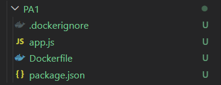

---

## Step 1 — Create the Project Folder

### Windows
1. Go to your **Desktop**
2. Right-click on empty space → **New** → **Folder**
3. Name it `PA1`

---

## Step 2 — Create Files:

1. App.js

It is a web application, and it creates a tiny web server to run in http://localhost:3000

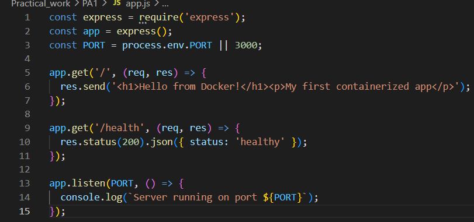


2. package.json

It is a list of Node.js telling about:
- What this project is called (docker-web-app)
- What libraries it needs to download (express)
- How to start the app (node app.js)

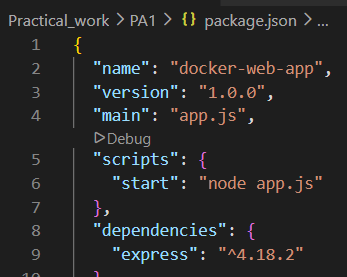

3. Dockerfile

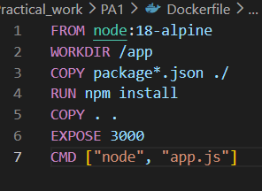

### What each line means:

| Line | What it does |
|------|--------------|
| `FROM node:18-alpine` | Use a small Linux image that already has Node.js |
| `WORKDIR /app` | All commands will run inside the `/app` folder |
| `COPY package*.json ./` | Copy package files first (speeds up future builds) |
| `RUN npm install` | Install the express library inside the image |
| `COPY . .` | Copy all your code files into the image |
| `EXPOSE 3000` | Tell Docker the app uses port 3000 |
| `CMD ["node", "app.js"]` | Command that runs when container starts |
 


4. .dockerignore

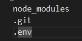

--- 

## Step 3  — Docker Setup

1. Run the following command:

```bash
docker --version
```
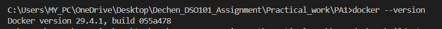

2. Build the Docker Image

In the VS Code terminal, type this command and press Enter:

```bash
docker build -t my-app:1.0 .
```

Build the image

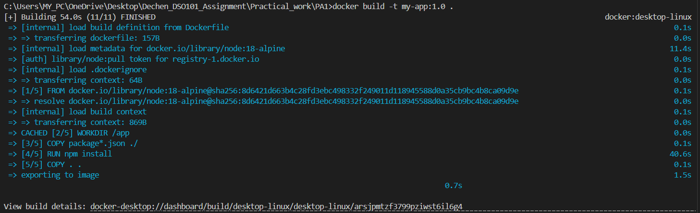

3. Run the container

```bash
docker run -d -p 3000:3000 --name my-app my-app:1.0
```

Run the image:

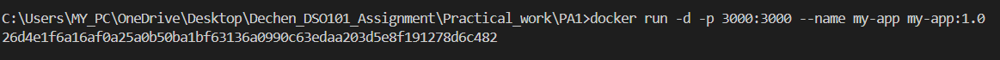

---

## Step 4 -  Open in Browser

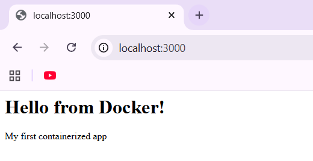

## Step 5: Open in Docker

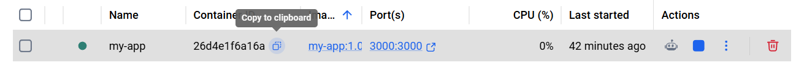

---

## Step 5 - Stop Everything

```bash 
docker stop my-app
docker rm my-app
```

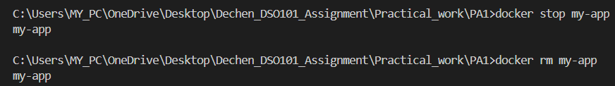

Then, in Docker:

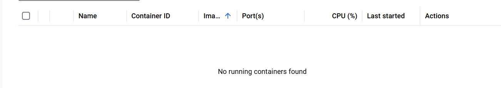


---

| Part of command | What it means |
|-----------------|---------------|
| `-d` | Run in the background |
| `-p 3000:3000` | Connect your computer's port 3000 to the container's port 3000 |
| `--name my-app` | Give the container a name |
| `my-web-app:1.0` | Which image to use |

---

## Step 12 — Open in Your Browser

1. Open **Chrome**, **Firefox**, or **Edge**
2. In the address bar type:

```
http://localhost:3000
```

3. Press **Enter**

You should see:

> ## Hello from Docker!
> My first containerized app

🎉 **Your app is running inside a Docker container!**

---

## Step 13 — Test the Health Check

In the browser go to:

```
http://localhost:3000/health
```

You should see:
```json
{ "status": "healthy" }
```

---

## Step 14 — See Container Logs

In the terminal:

```bash
docker logs my-app
```

Expected output:
```
Server running on port 3000
```

---

## Step 15 — Stop and Clean Up

When you are done, stop and remove the container:

```bash
docker stop my-app
docker rm my-app
```

---

## All Commands Summary

```bash
# Check Docker is working
docker --version

# Build the image
docker build -t my-web-app:1.0 .

# Run the container
docker run -d -p 3000:3000 --name my-app my-web-app:1.0

# See running containers
docker ps

# See logs
docker logs my-app

# Go inside the container
docker exec -it my-app sh

# Stop the container
docker stop my-app

# Delete the container
docker rm my-app

# See all images
docker images
```

---

## Troubleshooting

| Problem | Fix |
|---------|-----|
| `docker: command not found` | Docker Desktop is not open — open it and wait for green status |
| `port is already in use` | Change `-p 3000:3000` to `-p 3001:3000` and go to `localhost:3001` |
| `Cannot connect to Docker daemon` | Restart Docker Desktop |
| Page not loading in browser | Make sure container is running with `docker ps` |
