# Digital Clock Project Report
**Course:** DSO101 - Continuous Integration and Continuous Deployment  
**Program:** Bachelor's of Engineering in Software Engineering (SWE)  
**Student:** Dechen  
**GitHub Repository:** [Dechen-0349/digital-clock](https://github.com/Dechen-0349/digital-clock)  
**Live URL:** [digital-clock.onrender.com](https://digital-clock.onrender.com)

---

# PART 1: Project Overview

## What is the Digital Clock Project?

A real-time digital clock web application that displays current time across multiple timezones with a modern glass-morphism UI, automated CI/CD pipeline using GitHub Actions, and deployment to Render cloud platform.

---

## Features

* Live digital clock (updates every second)
* Date display (Day, Month, Year)
* 8 timezone support
* Responsive glass-morphism design
* Automated testing on every push
* Auto-deployment to Render

---

## Technology Stack

| Layer | Technology |
| ----- | ---------- |
| Backend | Python 3.11, Flask |
| Frontend | HTML5, CSS3, JavaScript |
| Timezone | pytz library |
| CI/CD | GitHub Actions |
| Hosting | Render |
| Version Control | Git, GitHub |

---

## Project Architecture

* **Flask Backend** – Serves the web page and handles timezone API calls
* **HTML/CSS Frontend** – Displays the clock and handles UI interactions
* **GitHub Actions** – Tests code on every push
* **Render** – Hosts the live application

---

## Basic Commands (Local Development)

```bash
cd digital-clock
python app.py
pip install flask pytz
```
---

# PART 2: Local Development Setup

## Project Folder Creation

```bash
cd C:\Users\MY_PC\OneDrive\Desktop\Dechen_DSO101_Assignment
mkdir digital-clock
cd digital-clock

```
For example for Bhutan Time (BTT):
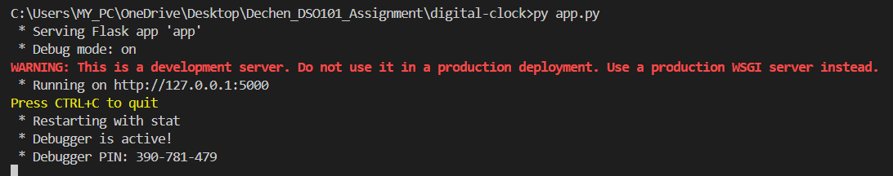
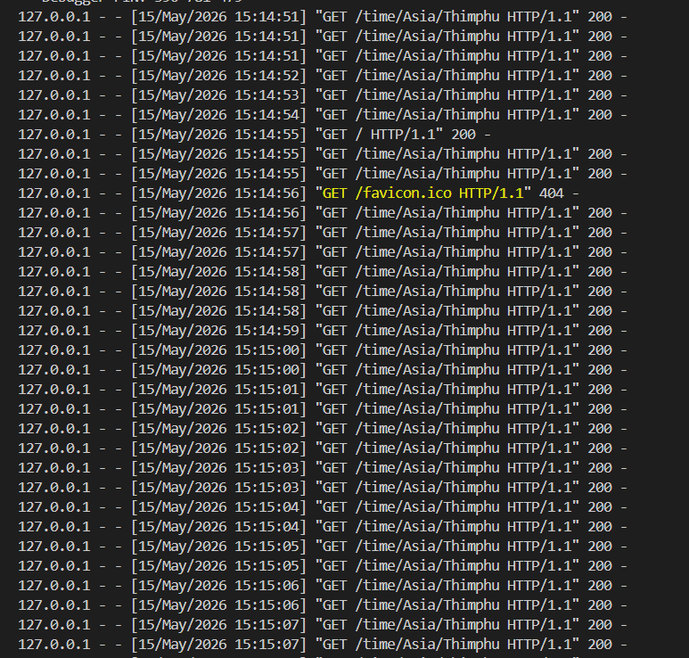
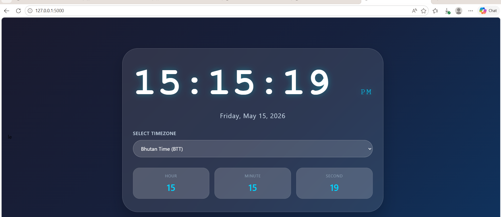

There are more other languages:

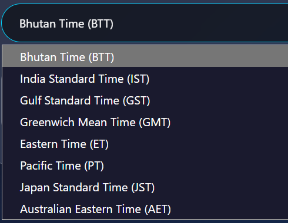


## Installing Dependencies

```bash
pip install flask pytz
```
---

## Project Files Created

| File | Purpose |
| ---- | ------- |
| app.py | Main Flask application |
| templates/index.html | Frontend template |
| requirements.txt | Dependencies list |


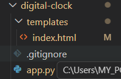

---

## Running Locally

```bash
python app.py
```
---

# PART 3: Flask Application Code

## app.py - Main Application

```python
from flask import Flask, render_template
from datetime import datetime
import pytz
import os

app = Flask(__name__)

timezones = [
    ("Asia/Thimphu", "Bhutan Time (BTT)"),
    ("Asia/Kolkata", "India Standard Time (IST)"),
    ("Asia/Dubai", "Gulf Standard Time (GST)"),
    ("Europe/London", "Greenwich Mean Time (GMT)"),
    ("America/New_York", "Eastern Time (ET)"),
    ("America/Los_Angeles", "Pacific Time (PT)"),
    ("Asia/Tokyo", "Japan Standard Time (JST)"),
    ("Australia/Sydney", "Australian Eastern Time (AET)"),
]

@app.route("/")
def index():
    return render_template("index.html", timezones=timezones)

@app.route("/time/<tz>")
def get_time(tz):
    try:
        timezone = pytz.timezone(tz)
        now = datetime.now(timezone)
        return {
            "hour": now.strftime("%H"),
            "minute": now.strftime("%M"),
            "second": now.strftime("%S"),
            "am_pm": now.strftime("%p"),
            "date": now.strftime("%A, %B %d, %Y")
        }
    except:
        timezone = pytz.timezone("Asia/Thimphu")
        now = datetime.now(timezone)
        return {
            "hour": now.strftime("%H"),
            "minute": now.strftime("%M"),
            "second": now.strftime("%S"),
            "am_pm": now.strftime("%p"),
            "date": now.strftime("%A, %B %d, %Y")
        }

if __name__ == "__main__":
    port = int(os.environ.get("PORT", 5000))
    app.run(debug=True, host="0.0.0.0", port=port)
```

---

## requirements.txt

```text
flask
gunicorn
pytz
```

---

#  PART 4: GitHub Repository Setup

## Creating GitHub Repository

* Navigate to github.com
* Click "+" → "New repository"
* Name: digital-clock
* Choose Public
* Click "Create repository"

---

## Pushing Code to GitHub

```bash
git init
git add .
git commit -m "Initial commit - Digital clock with Flask"
git branch -M main
git remote add origin https://github.com/Dechen-0349/digital-clock.git
git push -u origin main
```

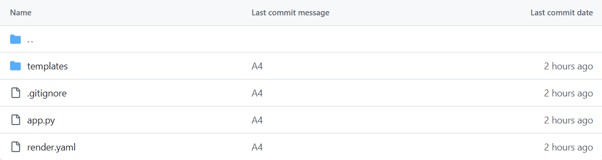
---

# PART 5: GitHub Actions CI/CD Pipeline

## Workflow File (.github/workflows/deploy.yml)

```yaml
name: Deploy to Render

on:
  push:
    branches: [ main ]
  pull_request:
    branches: [ main ]

jobs:
  test-and-deploy:
    runs-on: ubuntu-latest
    
    steps:
    - uses: actions/checkout@v3
    
    - name: Set up Python
      uses: actions/setup-python@v4
      with:
        python-version: '3.11'
    
    - name: Install dependencies
      run: |
        python -m pip install --upgrade pip
        pip install -r requirements.txt
    
    - name: Test Flask App
      run: |
        python -c "from app import app; print('App loaded successfully')"
    
    - name: Lint with flake8
      run: |
        pip install flake8
        flake8 app.py --count --select=E9,F63,F7,F82 --show-source --statistics
```
---

## Pushing Workflow to GitHub

```bash
git add .
git commit -m "Add GitHub Actions CI/CD workflow"
git push origin main
```
---

# PART 6: Render Deployment

## Creating Web Service

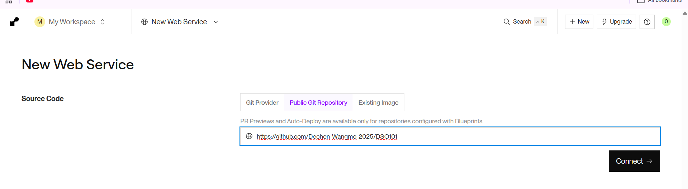

---

## Configuration Settings

| Setting | Value |
| ------- | ----- |
| Name | digital-clock |
| Region | Singapore |
| Branch | main |
| Runtime | Python 3 |
| Build Command | pip install -r requirements.txt |
| Start Command | gunicorn app:app |

---

## Deployment

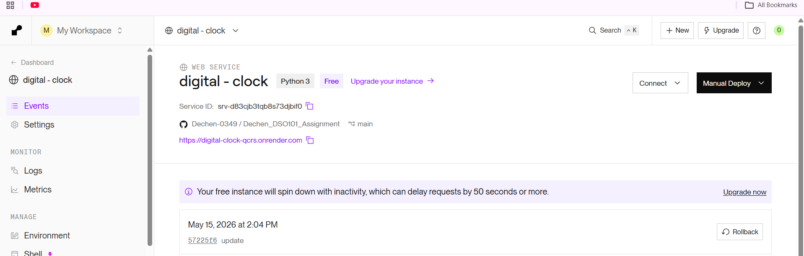

---

## Live Application

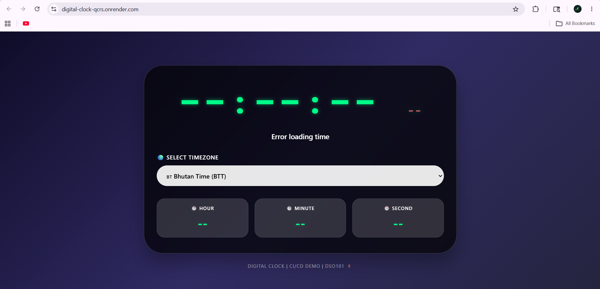


---

# Unit 7: Testing & Validation

## Automated Tests

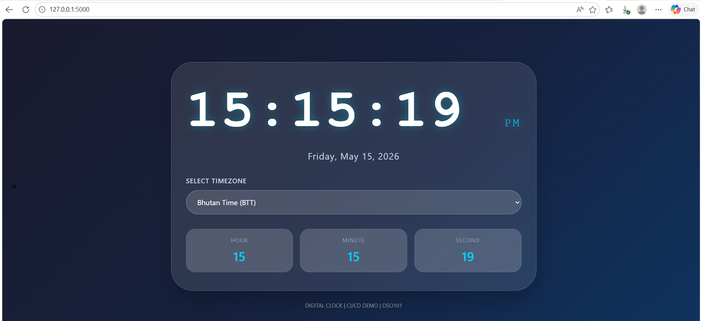

---

## Manual Testing Results

| Test Case | Expected Result | Status |
| --------- | --------------- | ------ |
| Clock updates every second | Numbers change | ✅ PASS |
| Timezone dropdown works | Time changes | ✅ PASS |
| Date displays correctly | Shows current date | ✅ PASS |
| Mobile responsive | Layout adjusts | ✅ PASS |
| Local server runs | 127.0.0.1:5000 works | ✅ PASS |
| Render deployment | Live URL accessible | ✅ PASS |

---

# PART 8: Challenges & Solutions

## 
---

## Challenge 1: Render requirements.txt Not Found

**Error:** Build failed - No requirements.txt

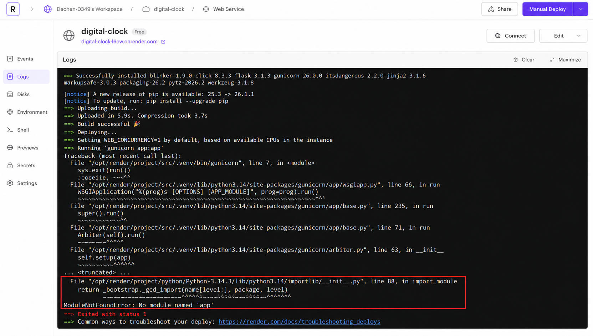


**Solution:** Created dedicated repository with files at root level

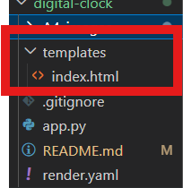

---

## Challenge 2: Render Deploy Logging Error

**Error:** Happens when Python cannot find any module called app that I used in this practical i.e. app.py


**Solution:** Change the Start Command to gunicorn digital-clock.app:app
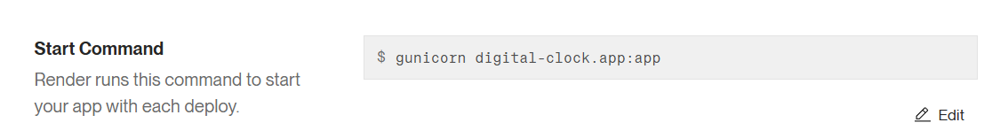


## Challenge 3: 

**Error:** White text on white background

**Solution:** Updated CSS with better color contrast (green time on dark background)

---

# PART 9: Conclusion

## Project Achievements

| Achievement | Status |
| ----------- | ------ |
| Live digital clock | ✅ Completed |
| Multiple timezone support | ✅ Completed |
| GitHub Actions CI/CD | ✅ Completed |
| Auto-deployment to Render | ✅ Completed |
| Responsive design | ✅ Completed |
| 24/7 live availability | ✅ Completed |

---

## Live URLs

| Platform | URL |
| -------- | --- |
| Render (Live) | https://digital-clock.onrender.com |
| GitHub Repository | https://github.com/Dechen-0349/digital-clock |

---

## References

- Flask Documentation: https://flask.palletsprojects.com/
- GitHub Actions: https://docs.github.com/en/actions
- Render Documentation: https://render.com/docs
- pytz Documentation: https://pythonhosted.org/pytz/

---

**Student Name:** Dechen Wangmo
**Course:** DSO101  
**Assignment:** Digital Clock with CI/CD  
**Submission Date:** May 15, 2026  
**Live URL:** https://digital-clock.onrender.com
