  # DSO101 Notes

  **Course:** DS0101 - Continuous Integration and Continuous Deployment  
  **Program:** Bachelor's Engineering in Software Engineering (SWE)  
  **Student:** Dechen Wangmo   
  **GitHub Repository:** [_02250349](https://github.com/Dechen-Wangmo-2025/DSO101.git)

  ---

  ## Table of Contents

  - [Unit 1: Introduction to Docker](#unit-1-introduction-to-docker)
  - [Unit 2: Docker Images and Containers](#unit-2-docker-images-and-containers)
  - [Unit 3: Dockerfile and Docker Compose](#unit-3-dockerfile-and-docker-compose)
  - [Unit 4: CI/CD and Jenkins](#unit-4-cicd-and-jenkins)
  - [Unit 5: Advanced Pipeline](#unit-5-advanced-pipeline)

  ---

  # Unit 1: Introduction to Docker

  ## What is Docker?
  Docker is a tool used to create, run, and manage containers.

  A container is a lightweight package that contains:
  - Application code
  - Libraries
  - Dependencies
  - Runtime environment
  This helps applications run the same way on every computer.

  ## Significance of Docker?

  Before Docker:
  - Applications worked differently on different systems
  - Dependency issues occurred frequently
  - Deployment was slow

  After Docker:
  - Consistent environments
  - Easy deployment
  - Faster development

  ---

  ## Features of Docker

  - Lightweight
  - Portable
  - Fast startup
  - Scalable
  - Isolated environments

  ---

  ## Docker Components

  - **Docker Engine** - Main serivce that runs the Docker.
  - **Docker Client** – Command line interface (CLI)
  - **Docker Daemon** – Background service that manages containers
  - **Docker Images** – Read-only blueprints for containers used to create containers
  - **Docker Containers** – Running instances of images
  - **Docker Registry** – Stores Docker images (e.g., Docker Hub)

  ---

  ## Docker vs Virtual Machines

  | Feature | Docker (Containers) | Virtual Machines |
  |---------|---------------------|------------------|
  | Size | Lightweight (MBs) | Heavy (GBs) |
  | Boot Time | Seconds | Minutes |
  | Performance | Near-native | Slower (hypervisor overhead) |
  | Isolation | Process-level | Full OS |
  | Resource Usage | Shares host OS kernel | Dedicated OS per VM |

  ## Docker Workflow

  ```text
  Dockerfile → Docker Image → Docker Container
  ```

  ---

  ## Basic Commands

  ```bash
  `docker --version`
  ```

  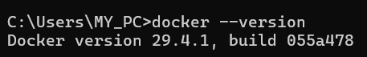

  ```bash
  `docker info`
  ```

  It displays system-wide information

  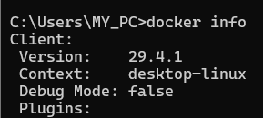

  ```bash
  `docker help`
  ```

  It helps get hellp from other Docker commands

  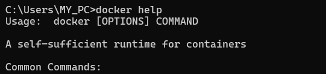

  ---


  `pwd`
  Shows you which folder you are currently in.
  ```bash
  pwd
  ```

  ---

  `ls`
  Shows all the files and folders in your current location.
  ```bash
  ls
  ls -la    # includes hidden files and details
  ```

  ---

  `cd`
  Moves you into a different folder.
  ```bash
  cd Documents      # go into a folder
  cd ..             # go back one level
  cd ~              # go to your home folder
  ```

  ---

  `mkdir`
  Creates a new folder.
  ```bash
  mkdir my_project
  ```

  ---

  `touch`
  Creates a new empty file.
  ```bash
  touch notes.txt
  ```

  ---

  `cp`
  Copies a file or folder to another location.
  ```bash
  cp file.txt backup/         # copy a file
  cp -r folder/ backup/       # copy an entire folder
  ```

  ---

  `mv`
  Moves or renames a file or folder.
  ```bash
  mv old.txt new.txt          # rename
  mv file.txt Documents/      # move to another folder
  ```

  ---

  `rm`
  Deletes a file or folder permanently.
  ```bash
  rm file.txt           # delete a file
  rm -r folder/         # delete a folder and everything in it
  ```

  ---

  `rmdir`
  Deletes an empty folder only.
  ```bash
  rmdir empty_folder
  ```

  ---

  `cat`
  Prints the full content of a file on screen.
  ```bash
  cat notes.txt
  ```

  ---

  `grep`
  Searches for a word or pattern inside a file.
  ```bash
  grep "error" log.txt
  grep -r "TODO" ./project/     # search inside all files in a folder
  ```

  ---

  `find`
  Searches for files and folders by name or type.
  ```bash
  find . -name "*.txt"          # find all .txt files
  find . -type d                # find only folders
  ```

  ---

  ```bash
  docker ps -a
  ```
  It lists all containers including those which are stopped.

  ---

  # Unit 2: Docker Images and Containers

  ## `Important Docker Commands`

  ---

  ## Images

  `docker build`
  Builds a Docker image from a Dockerfile.
  ```bash
  docker build -t my-app:1.0 .
  ```

  ---

  `docker pull`
  Downloads an image from Docker Hub.
  ```bash
  docker pull node:18-alpine
  docker pull nginx
  ```

  ---

  `docker push`
  Uploads your image to Docker Hub.
  ```bash
  docker push username/my-app:1.0
  ```

  ---

  `docker images`
  Shows all images on your computer.
  ```bash
  docker images
  ```

  ---

  `docker rmi`
  Deletes an image from your computer.
  ```bash
  docker rmi my-app:1.0
  ```

  ---

  ## Containers

  `docker run`
  Creates and starts a container from an image.
  ```bash
  docker run my-app:1.0                      # basic run
  docker run -d my-app:1.0                   # run in background
  docker run -p 3000:3000 my-app:1.0         # map ports
  docker run --name my-container my-app:1.0  # give it a name
  docker run -e NODE_ENV=production my-app   # pass environment variable
  ```

  ---

  `docker ps`
  Shows all currently running containers.
  ```bash
  docker ps
  docker ps -a    # includes stopped containers too
  ```

  ---
  # Docker — Port Mapping, Detached Mode & Logs


  ## Port Mapping `-p HOST:CONTAINER`
  Connects your computer's port to the container's port so you can open the app in a browser.
  ```bash
  docker run -p 8080:80 nginx
  # your computer port 8080 → container port 80
  # open browser at http://localhost:8080
  ```

  ---

  ## Host Port vs Container Port

  ```
  YOUR COMPUTER  ──▶  CONTAINER
    8080        ──▶     80
  (you visit)       (app runs here)
  ```

  - **Host Port** → the port YOU type in the browser
  - **Container Port** → the port the app is listening on inside Docker

  ---

  ## 5 Types of Port Mapping

  **1. Same ports on both sides**
  ```bash
  docker run -p 3000:3000 my-app
  ```

  **2. Different ports**
  ```bash
  docker run -p 8080:80 nginx
  ```

  **3. Restrict to your computer only**
  ```bash
  docker run -p 127.0.0.1:8080:80 nginx
  ```

  **4. Multiple ports at once**
  ```bash
  docker run -p 8080:80 -p 443:443 nginx
  ```

  **5. Let Docker pick a random port**
  ```bash
  docker run -p 80 nginx
  ```

  ---

  ### Detached Mode `-d`
  Runs the container in the background so your terminal stays free.
  ```bash
  docker run -d nginx
  # terminal is free, container runs behind the scenes
  ```

  The period `.` at the end of the docker build command means "use the current folder".

  ---

  # Docker Lab in KodeKloud

  ## LAB1 - Docker Basic Commands 
  1.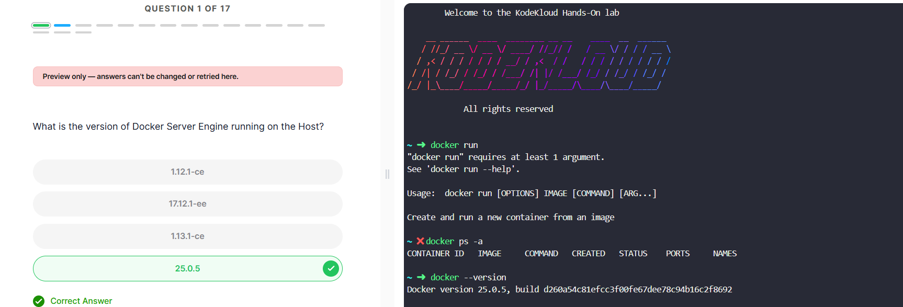

  2.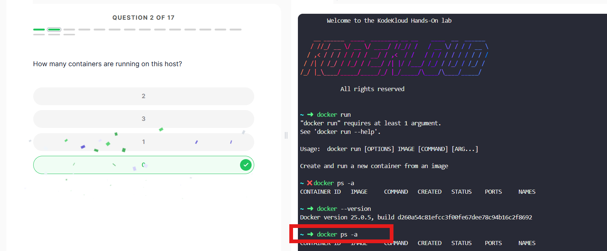

  3.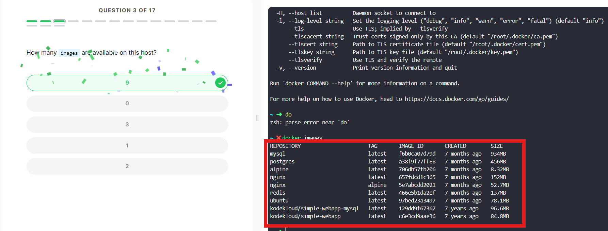

  4.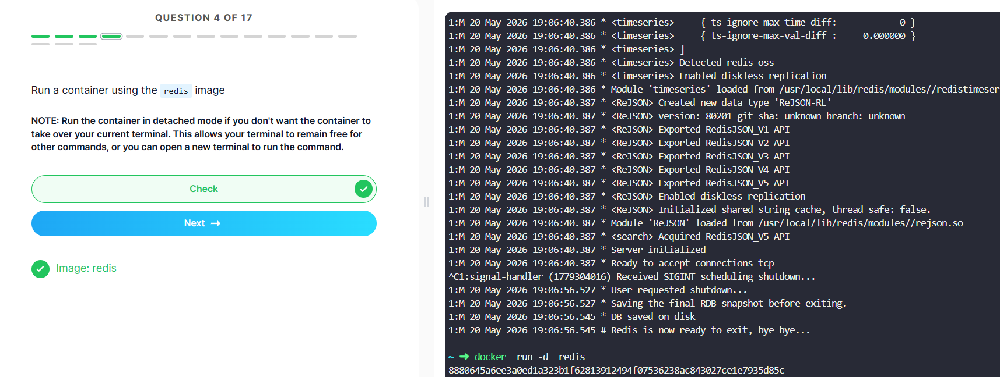

  5.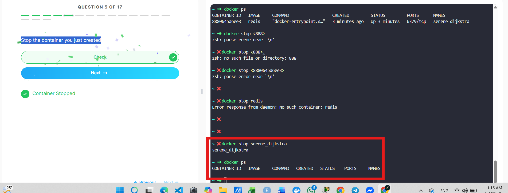

  6.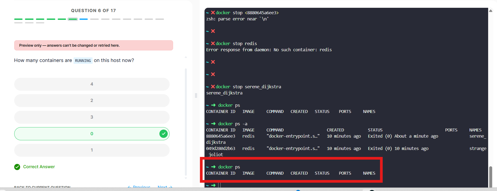

  7.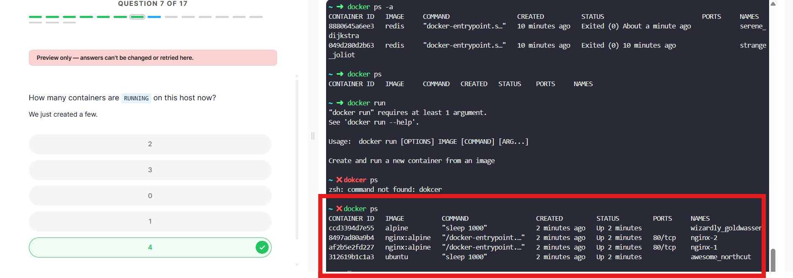

  8.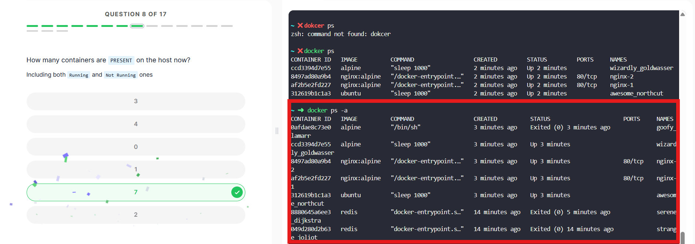

  9.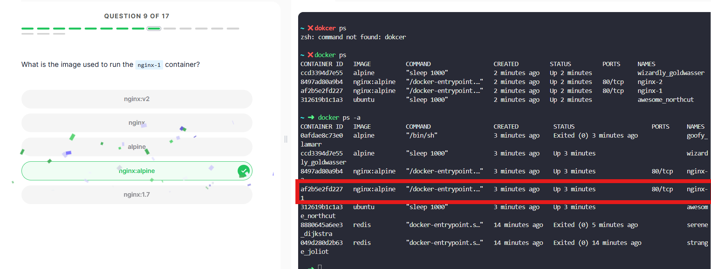

  10.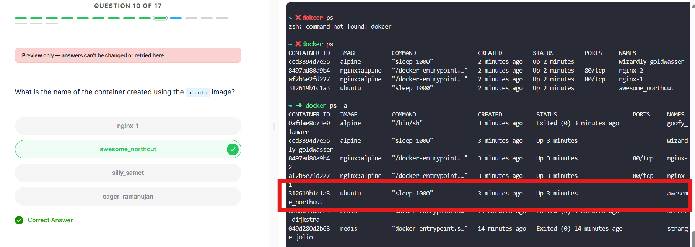

  11.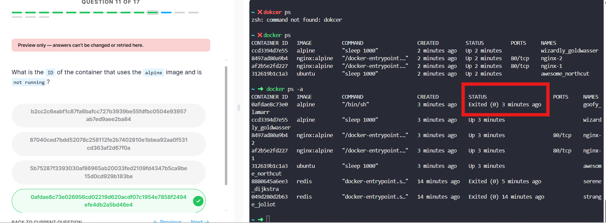

  12.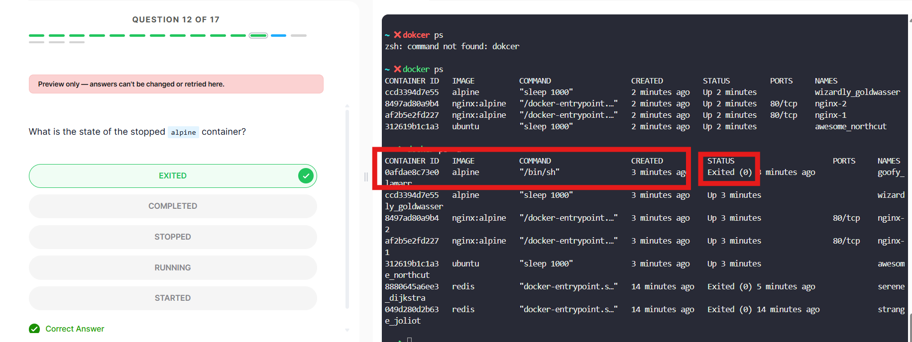

  ```bash
  docker stop $(docker ps -q)
  ```

  The `$(docker ps -q)` will return all the containers by their IDs.

  13.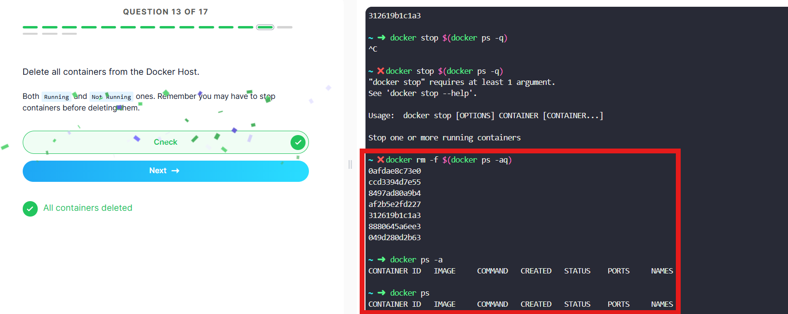

  14.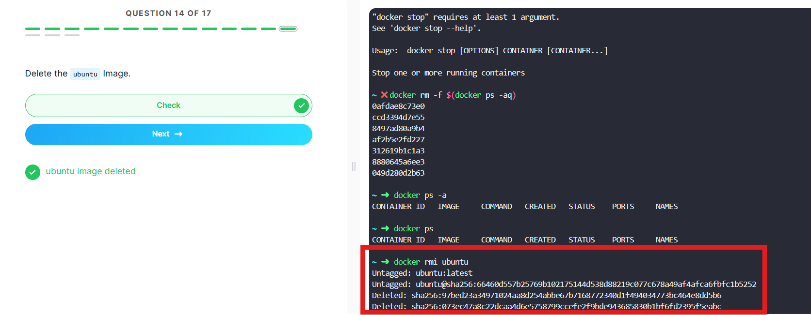

  15.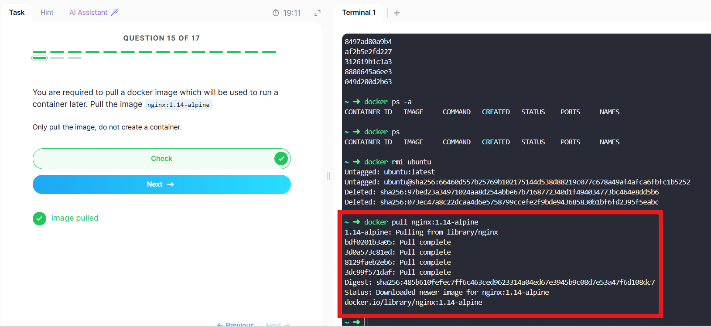

  16.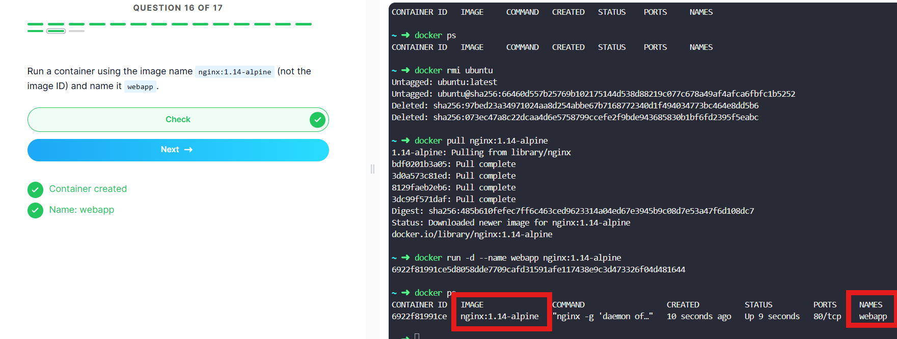

  17.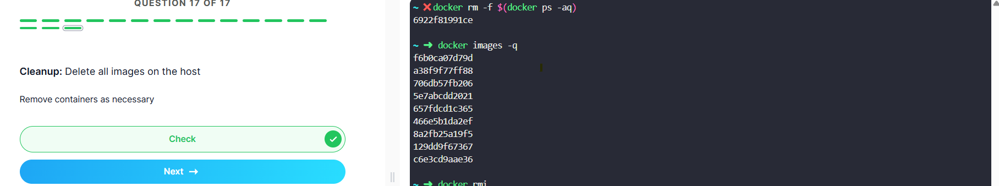

  ```bash
  `docker rmi $(docker images -aq)`
  ```
  It is used to remove the above selected images in the above image.

  ---

  ## LAB2 -  Docker Run 

  1.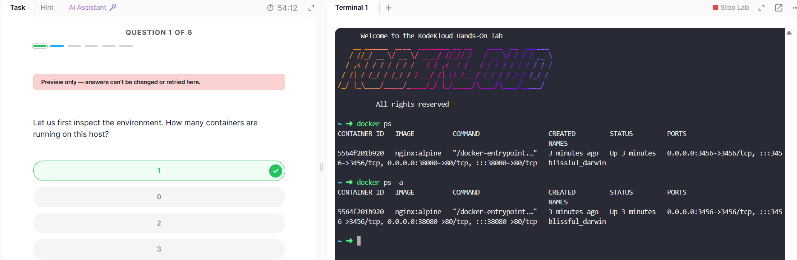

  2.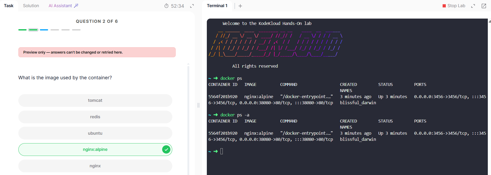

  3.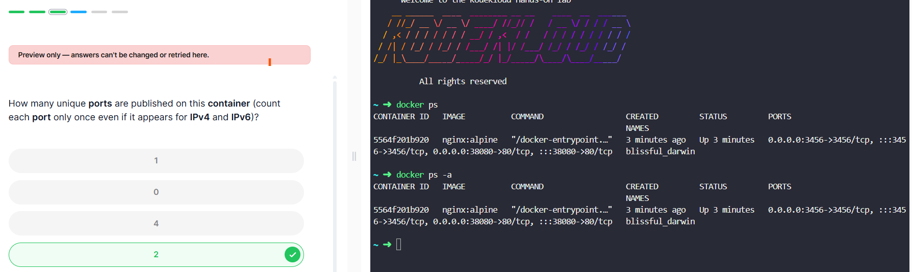

  4.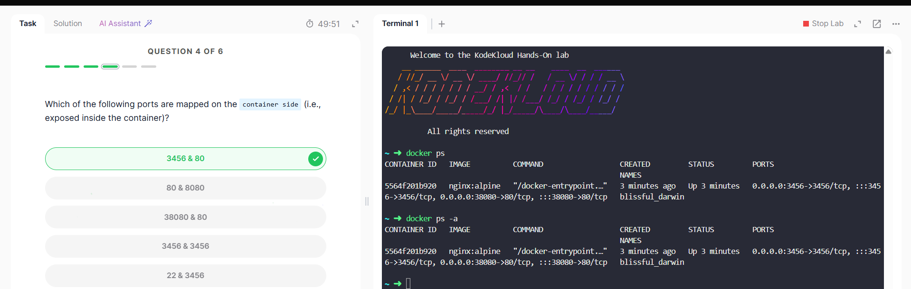

  5.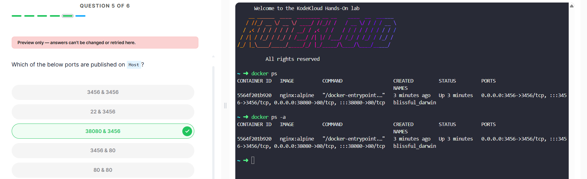

  6.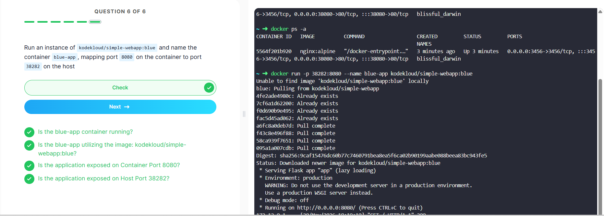


  # Unit 3 - Dockerfile and Docker Compose

  --- 

  ## Dockerfile:

  It is shopping list or set of instructions that tells Docker how to build an app's image.

  # Unit 3: Dockerfile & Docker Compose

  > A beginner-friendly reference for Docker concepts, commands, and configuration.

  ---

  ## Table of Contents

  - [What is Docker?](#what-is-docker)
  - [Part 1: Dockerfile](#part-1-dockerfile)
  - [Part 2: Docker Compose](#part-2-docker-compose)
  - [Part 3: Volumes](#part-3-volumes-saving-data)
  - [Part 4: Networks](#part-4-networks-containers-talking)
  - [Summary](#summary-table)
  - [Cheat Sheet](#cheat-sheet)
  - [Common Mistakes](#common-beginner-mistakes)
  - [Real Life Analogy](#real-life-analogy)

  ---

  ## What is Docker?

  - Docker = a way to **package your app** so it runs anywhere
  - Like a **virtual machine** but much lighter and faster

  ---

  ## Part 1: Dockerfile

  ### Part 1: What is a Dockerfile?

  A **shopping list** of instructions that tells Docker how to build your app's image.

  ```dockerfile
  FROM node:22-alpine    # Start with this base image

  WORKDIR /app           # Create a working folder inside the container

  COPY package.json .    # Copy your dependencies list

  RUN npm install        # Install everything needed

  COPY . .               # Copy the rest of your code

  CMD ["npm", "start"]   # Command to run when container starts
  ```
  ---

  ### Build & Run Commands

  ```bash
  # Build image from Dockerfile
  docker build -t my-app .

  # Run the container
  docker run -p 3000:3000 my-app
  ```

  ---

  ## Part 2: Docker Compose

  A tool to **run multiple containers together** with one command.


  ### Example `docker-compose.yml`

  ```yaml
  version: '3'

  services:
    web:                    # Container 1: Web server
      image: nginx
      ports:
        - "8080:80"         # host:container port mapping

    app:                    # Container 2: Your app
      build: .                  # Build from Dockerfile in current folder
      ports:
        - "3000:3000"

    database:                   # Container 3: Database
      image: postgres
      environment:
        POSTGRES_PASSWORD: secret
  ```

  ### Docker Compose Commands

  | Command | What it does |
  |---------|--------------|
  | `docker-compose up` | Start all containers |
  | `docker-compose up -d` | Start all containers in background |
  | `docker-compose down` | Stop and remove all containers |
  | `docker-compose build` | Rebuild images |
  | `docker-compose logs` | View logs / error messages |
  | `docker-compose ps` | List running services |
  | `docker-compose stop` | Pause containers (don't remove them) |

  ### Compose Configuration Keys

  | Key | Purpose |
  |-----|---------|
  | `depends_on` | Service dependency / start order |
  | `environment` | Set environment variables |
  | `env_file` | Load env vars from `.env` file |
  | `restart` | Restart policy (`always`, `on-failure`) |
  | `container_name` | Give container a fixed name |
  | `volumes` | Attach volumes for persistence |
  | `networks` | Attach to custom networks |

  ---

  ## Part 3: Volumes (Saving Data)

  Containers are temporary — if you delete a container, the data inside is gone forever.

  Hence; Volumes = **storage lockers** that survive even if the container is deleted.

  ### Volume Types

  | Type | Command | Where data is stored |
  |------|---------|----------------------|
  | Named volume | `-v mydata:/app/data` | Docker manages it |
  | Bind mount | `-v ./data:/app/data` | Your computer's folder |
  | Anonymous | `-v /data` | Docker manages it (unnamed) |

  ---

  ### Volume Commands

  ```bash
  # Create a named volume
  docker volume create mydata

  # Use a volume with a container
  docker run -v mydata:/app/data nginx

  # List all volumes
  docker volume ls

  # Delete a volume (WARNING: deletes all data!)
  docker volume rm mydata
  ```

  ### Volumes in Docker Compose

  ```yaml
  services:
    database:
      image: postgres
      volumes:
        - db_data:/var/lib/postgresql/data   # Attach named volume

  volumes:
    db_data:    # Declare the volume at the bottom
  ```

  ---

  # Docker Compose Lab in KodeKloud

1.
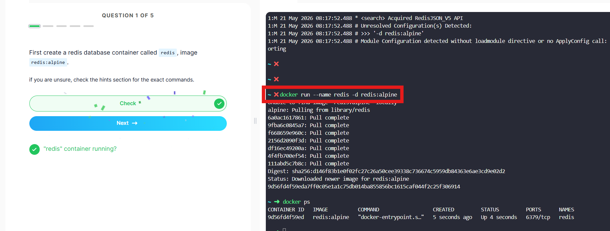
2.
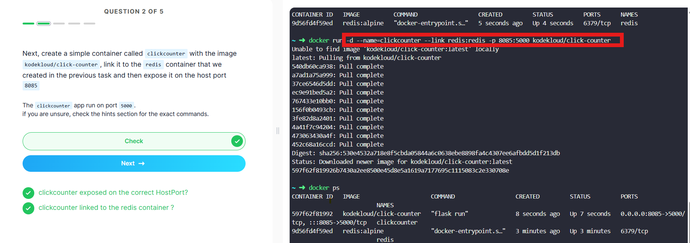
3.
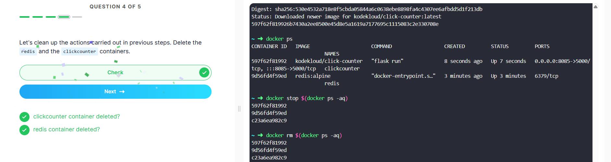
4.
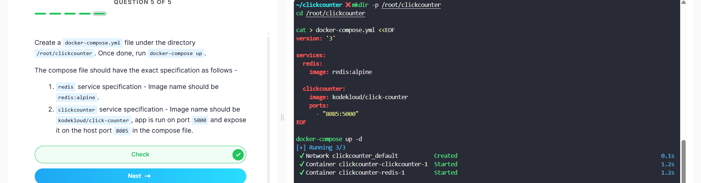

Local Host:
The count will increase with the number of login or action or any event.

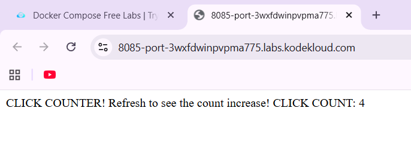

---

  ## Part 4: Networks (Containers Talking)

  By default, containers are **isolated** and cannot communicate with each other.

  So, Networks = **telephone lines** connecting containers together.

  ### Network Commands

  | Command | What it does |
  |---------|--------------|
  | `docker network ls` | List all networks |
  | `docker network create mynet` | Create a new network |
  | `docker network connect mynet container1` | Connect a container to a network |
  | `docker network inspect mynet` | View network details |

  ---

  Containers communicate with images in the network :
  ```
  Without network → need IP addresses (complicated)
  With network    → containers talk using names (simple!)
  ```

  ### Networks in Docker Compose (Automatic!)

  It was used for automatic deployment

  ```yaml
  services:
    app:
      build: .
      networks:
        - mynetwork

    database:
      image: postgres
      networks:
        - mynetwork

  networks:
    mynetwork:    # Declare the network here
  ```

  ---

  ## Summary Table

  | Concept | One-line explanation |
  |---------|----------------------|
  | **Dockerfile** | Recipe to build one container image |
  | **Docker Compose** | Tool to run multiple containers together |
  | **Volume** | Save data so it's not lost when container stops |
  | **Network** | Let containers talk to each other |

  ---

  ```bash
  # --- Dockerfile ---
  docker build -t myapp .          # Build image from Dockerfile
  docker run -p 8080:80 myapp      # Run container with port mapping

  # --- Compose ---
  docker-compose up -d             # Start all services in background
  docker-compose down              # Stop and remove all services
  docker-compose build             # Rebuild images
  docker-compose logs              # View logs
  docker-compose ps                # List running services

  # --- Volumes ---
  docker volume ls                 # List volumes
  docker volume create myvol       # Create a volume
  docker run -v myvol:/data nginx  # Use a volume

  # --- Networks ---
  docker network ls                # List networks
  docker network create mynet      # Create a network
  docker run --network mynet nginx # Run container on a network
  ```

  ---

  # Unit 4: CI/CD and Jenkins

  --- 

  ## What is CI/CD?

  | Term | Meaning |
  |------|---------|
  | **CI (Continuous Integration)** | Merge code often → Auto build + test → Catch bugs early |
  | **CD (Continuous Delivery)** | Code always ready to deploy → Manual button to production |
  | **CD (Continuous Deployment)** | Every change that passes tests → Auto to production |

  ### Pipeline Flow

  Commit → Build → Test → Deploy to Staging → (Manual?) → Production


  ### Why CI/CD?
  - Find bugs early (cheap to fix)
  - Deploy faster with less stress
  - No manual testing/release time waste

  ---

  ## Jenkins Architecture

  | Component | Role |
  |-----------|------|
  | **Master (Controller)** | Manages jobs, UI at port 8080, stores config (no building) |
  | **Agent (Node)** | Does actual building/testing. Can run on different OS |

  One master can manage many agents = parallel builds

  ---

  ## Jenkinsfile 

  | Keyword | What it does |
  |---------|--------------|
  | `agent` | Tells Jenkins *where* to run (`any`, `docker`, `label`) |
  | `stages` | The wrapper that holds all your stages |
  | `stage` | A named section — Build, Test, Deploy, etc. |
  | `steps` | The actual commands that run inside a stage |
  | `post` | Runs after everything — cleanup, notifications, reports |

  ---

  ## Plugins

  Jenkins by itself is just an empty shell. The plugins are what make it actually useful.

  ### Must-Have Plugins

  | Plugin | Why you need it |
  |--------|----------------|
  | **Git** | Pull your source code from GitHub/GitLab |
  | **Pipeline** | Enables Jenkinsfile support |
  | **JUnit** | Reads test results and shows pass/fail graphs |
  | **Blue Ocean** | A much nicer, modern UI for pipelines |
  | **Docker Pipeline** | Build and push Docker images from Jenkinsfile |
  | **NodeJS** | Run `npm` commands in your pipeline |
  | **Slack / Email Extension** | Get notified when builds break |

  **How to install:** Manage Jenkins → Plugins → Available → Search → Install

  ---

  **Important command for the Jenkinfile to work on the Dashboard and Docker Hub**

  ```bash
  # Jenkins
  localhost:8080                          # Open Jenkins UI

  # Docker
  docker build -t myapp:latest .          # Build image
  docker push myusername/myapp:latest     # Push to Docker Hub
  docker login                            # Authenticate with Docker Hub
  ```

  ---

  ## Common Errors & Fixes

  | Error | Fix |
  |-------|-----|
  | `No such file or directory` | Check your working directory — use `pwd` step to debug |
  | `Permission denied` | Add `sudo` or fix file permissions |
  | `Credentials not found` | Re-add the credential in Jenkins UI and check the ID matches |
  | `Git clone failed` | Your PAT might be expired or you picked the wrong credential |
  | `Docker: permission denied` | Add Jenkins user to the `docker` group |

  ---


  ## Conclusion

  - **CI** = build + test automatically on every commit
  - **CD** = deploy automatically (or near-automatically)
  - **Master** manages, **Agent** does the work
  - Always use **Pipeline** jobs with a `Jenkinsfile` — not Freestyle
  - Jenkins UI lives at **port 8080**
  - Plugins are not optional — Jenkins is basically empty without them
  - Store credentials in Jenkins, **never** in your code
  - `post { always {} }` is useful for publishing test reports regardless of pass/fail

  ---

  # Unit 5: Advanced Pipeline

  # Unit 5: Advanced Pipeline

  ---

  ## Two Ways to Write a Pipeline

  ### Declarative — The Easy Way

  - Uses simple, pre-built blocks
  - You just fill in the blanks
  - **This is what beginners should use**

  ```groovy
  pipeline {
      agent any
      stages {
          stage('Build') {
              steps {
                  sh 'npm install'
              }
          }
      }
  }
  ```

  ### Scripted — The Hard Way

  - Uses full Groovy programming language
  - You write everything from scratch
  - Only needed for very complex pipelines

  ```groovy
  node('any') {
      stage('Build') {
          sh 'npm install'
          if (result == 'SUCCESS') {
              echo 'Good'
          }
      }
  }
  ```

  ### Which One Should You Use?

  | Your Situation | Use This |
  |----------------|----------|
  | Just starting out | Declarative ✅ |
  | Need complex custom logic | Scripted |

  ---

  ### Why Pipeline is written as a code

  - Everyone on the team can see the pipeline
  - Changes can be reviewed like normal code
  - You can undo mistakes easily (just revert the file)
  - Works automatically — Jenkins reads the file every time you push

  ---

  ## Useful Pipeline Tricks

  ### 1. Run Multiple Things at Once — `parallel`

  Normally stages run one after another. With `parallel`, they run at the **same time**.

  It cuts your pipeline time in half instead of waiting for each test to finish.

  ---

  ### 2. Only Run on Certain Branches — `when`

  You don't want to deploy to production every time someone pushes to a feature branch. Use `when` to control this. Feature branches will run tests but **skip** the deploy stage entirely.

  ---

  ### 3. Cleanup After the Pipeline — `post`

  We used this in Assignment 2 to publish Jest test results even when the build failed.

  ---

  ### 4. Use Variables — `environment`

  Define a value once and reuse it anywhere in the pipeline.

  Then use it like: `echo "Building ${APP_NAME}"`

  ---

  ### 5. Keep Passwords Safe — `credentials`

  **Never write passwords directly in your Jenkinsfile.** It goes to GitHub and anyone can see it.

  Instead, store credentials inside Jenkins and reference them like this:

  ```groovy
  environment {
      DOCKER_CREDENTIALS = credentials('docker-creds')
  }
  ```

  Jenkins then gives you two safe variables automatically:
  - `DOCKER_CREDENTIALS_USR` — the username
  - `DOCKER_CREDENTIALS_PSW` — the password

  ---


# CONCLUSION

## Unit 1 

  In this unit I learnt the concept of Docker and how it solves packaging everything an app;ication needs into a container and learnt the foundation with the basic commands for image building and image commands.

---

## Unit 2:

  In this unit, i got hads-on practice with using Docker with the basic commands such as build, run and push. I practised the docker foundations in Kodekloud labs and learnt basic port mapping between the browser and the container.

---

## Unit 3:

  In this unit I learnt how to write a Dockerfile to build images and how each component in the Dockerfile is essential for connecting the frontend and backend for deployment, in Render.

---

## Unit 4:

  In this unit I learnt the concepts of CI/CCD and Jenkins where using the Jenkinfile, I understood how building, testing na d deploying the apaplication with pipeline can be automated. Moreover, with GitHub, run Jest tests, and building docker images and pushing them to the Docker Hub are connected for automatic deployment.


## Unit 5:

   In this unit, using the foundational concepts I learnt in the previous unit, I understood how to mitigate the errors or implications that causes the automatic deployment in Jenkins to fail and how the pipeline can be modified with alignment to the GitHub.


